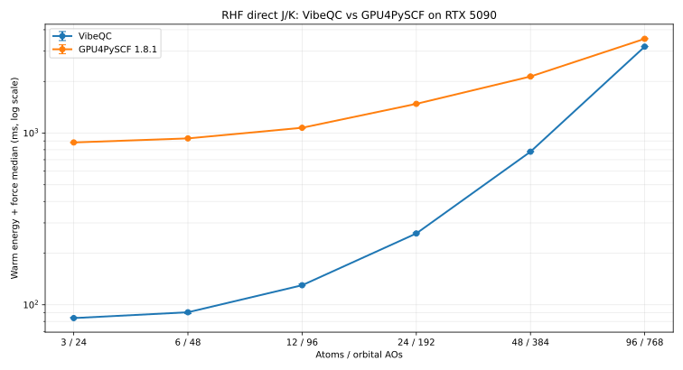

<!--
IMPORTANT: Keep this README concise and user-facing. It should contain only
the project identity, essential capabilities, installation, minimal examples,
and measured benchmarks. Put implementation history, kernel details,
benchmark analysis, and extended roadmaps in docs/ or
benchmarks/results/ instead of expanding this file.
-->

<p align="center">
  
</p>

<h1 align="center">VibeQC</h1>

<p align="center">
  GPU-native, batched quantum chemistry with analytic forces.
</p>

VibeQC combines **vibe coding** and **quantum chemistry**. It is a fully
vibe-coded quantum-chemistry program: humans set the scientific goals,
constraints, and review standards; coding agents produce and revise the code,
tests, benchmarks, and documentation. Numerical results are checked against
independent references, and performance claims require reproducible gates.

## Features

- CPU reference and CUDA backends.
- Ragged batches, per-system failure isolation, and density warm starts.
- Contracted Cartesian and real-spherical `s` through `f` Gaussian bases.
- Bundled STO-3G, def2-SVP, and def2-TZVP basis data for H-Ar.
- Python, C, and C++ interfaces; optional PyTorch analytic backward.

## Build and install

Requirements: CMake 3.24+, a C++20 compiler, Python 3.10+, and optionally CUDA
12.9 for the GPU backend.

```bash
cmake -S . -B build -G Ninja \
  -DCMAKE_CUDA_COMPILER=/path/to/cuda/bin/nvcc \
  -DCMAKE_CUDA_ARCHITECTURES=120
```

Two CMake presets make the build-time tradeoff explicit: `cuda-dev-fast`
targets one real device image and bounds concurrent NVCC jobs, while
`cuda-release-sm120` keeps the production optimization settings and full AOT
manifest.  The presets are starting points; set
`VIBEQC_CUDA_COMPILE_JOBS` to match the memory available on the build host.

```bash
cmake --preset cuda-dev-fast
cmake --build --preset cuda-dev-fast
```

CUDA 12.9 can also build portable generic binaries for `80`, `86`, `89`, and
`90`. Only `sm_120` currently has a measured generated-shell profile; other
targets automatically keep the validated generic CUDA kernels. A distributable
fat binary can be configured with:

```bash
cmake -S . -B build -G Ninja \
  -DCMAKE_CUDA_COMPILER=/path/to/cuda/bin/nvcc \
  -DVIBEQC_CUDA_ARCHITECTURES="80;90;120" \
  -DVIBEQC_AOT_PROFILES="sm_120"
```

Use `-DVIBEQC_ENABLE_AOT_SHELLS=OFF` to omit generated shell bundles entirely,
or `-DVIBEQC_AOT_PROFILE=portable` to retain an explicit empty portable profile.
Builds automatically use `sccache` or `ccache` when either is on `PATH`;
override this with `-DVIBEQC_COMPILER_CACHE=off` or an explicit executable.
Generated CUDA is split into eight stable shards by default.  Tune this with
`-DVIBEQC_AOT_SHARDS=N` when local compile parallelism or memory is limited.
The shard map is versioned and based on measured shell-class compile cost, so
manifest insertion/removal does not move unrelated classes.  Identical
generated bytes retain their timestamps and compiler-cache keys.
Development builds may set `-DVIBEQC_AOT_UNIT_MODE=class` to expose one object
target per manifest shell class; release presets retain `stable-shards`.

CUDA separable compilation is disabled by default because the current launch
ABI uses host wrappers rather than cross-translation-unit device calls.  Enable
the validation A/B with `-DVIBEQC_CUDA_SEPARABLE_COMPILATION=ON` when testing a
toolchain or introducing a genuine device-link dependency.  The requested
`120-real`/`120-virtual` suffix is retained for NVCC while profile directories
continue to use the canonical `sm_120` identity.

For compile-only CUDA experiments,
`-DVIBEQC_CUDA_SPLIT_COMPILE_THREADS=N` enables NVCC split compilation of the
large generic translation unit.  It defaults to `1` because split compilation
can change optimizer resource choices; use the normal setting for performance
and release binaries.

For CPU only, configure with:

```bash
cmake -S . -B build -G Ninja -DVIBEQC_ENABLE_CUDA=OFF
```

Then build and install:

```bash
cmake --build build -j10
python -m pip install -e .
```

The Python package finds `build/libvibeqc.so` automatically when built in the
repository. For another build location, set `VIBEQC_LIBRARY` to the shared
library path.

## Python API

Coordinates are in Bohr, energies in Hartree, and forces in Hartree/Bohr.

```python
from vibeqc import Calculator

calc = Calculator(method="rhf", basis="sto-3g", device="cuda")
result = calc.singlepoint([
    ("H", (0.0, 0.0, -0.7)),
    ("H", (0.0, 0.0, 0.7)),
])

print(result.energy)
print(result.forces)
```

Prepared batches retain reusable topology and density state:

```python
from vibeqc import Calculator

systems = [
    [("H", (0.0, 0.0, -0.7)), ("H", (0.0, 0.0, 0.7))],
    [("He", (0.0, 0.0, 0.0))],
]

calc = Calculator(method="rhf", basis="sto-3g", device="cuda")
with calc.prepare_batch(systems, warm_start=True) as batch:
    first = batch.execute(strict=True)
    second = batch.execute(strict=True)  # reuses compatible densities

print(first.energies)
```

## Benchmarks

The table below is the measured performance surface for each implemented
method. Each chart is a clickable thumbnail with the full-size SVG and raw
benchmark data. New methods can be added as new rows without maintaining a
separate support list.

| Method | Performance |
| --- | --- |
| HF | <a href="benchmarks/results/vibeqc-gpu4pyscf-atom-ao-scaling.svg"></a> |

The HF chart uses RHF direct J/K on an RTX 5090, with nested water topologies
from 3 atoms/24 AOs through 96 atoms/768 AOs. It reports warm energy-plus-force
replay time on a logarithmic scale under the benchmark's matched loose SCF
criteria; see the [raw measurements](benchmarks/results/vibeqc-gpu4pyscf-atom-ao-scaling.json)
for the exact protocol and values.

## Documentation

- [Documentation index](docs/index.md) — methods, batching, architecture, and
  implementation roadmap.
- [Benchmark results](benchmarks/results/README.md) — protocol, gates, and
  reproducible artifacts.

## License

VibeQC is licensed under [GPL-3.0-or-later](LICENSE).
