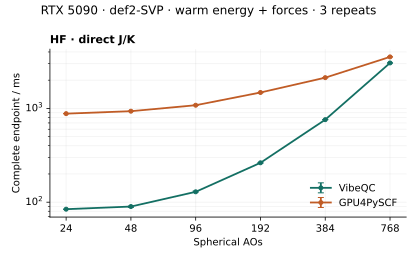

<!--
IMPORTANT: Keep this README concise and user-facing. It should contain only
the project identity, current supported methods, essential capabilities,
installation, and minimal examples. Put implementation history, kernel
details, benchmark analysis, and extended roadmaps in docs/ or
benchmarks/results/ instead of expanding this file.
-->

<p align="center">
  
</p>

<h1 align="center">VibeQC</h1>

<p align="center">
  <a href="https://codecov.io/gh/jinzhezenggroup/vibeqc"></a>
</p>

<p align="center">
  GPU-native, batched quantum chemistry with analytic forces.
</p>

VibeQC combines **vibe coding** and **quantum chemistry**. It is a fully
vibe-coded quantum-chemistry program: humans set the scientific goals,
constraints, and review standards; coding agents produce and revise the code,
tests, benchmarks, and documentation. Numerical results are checked against
independent references, and performance claims require reproducible gates.

## Features

- CPU reference and CUDA backends.
- Molecular GFN2-xTB energy and analytic forces on CPU and native CUDA SDK builds,
  including charged and standard restricted open-shell states for H-Rn. The method
  uses its intrinsic minimal basis; CUDA wheels and ragged-batch admission remain
  separate gates.
- Ragged batches, per-system failure isolation, and density warm starts.
- Contracted Cartesian and real-spherical Gaussian bases: `s` through `g` on
  CPU, `s` through `f` on CUDA. See [higher angular momentum](docs/user/high_angular_momentum.md).
- Bundled STO-3G, def2-SVP, and def2-TZVP basis data for H-Ar.
- [Offline local/custom basis input](docs/user/external_basis.md) with provenance,
  H–Og element identities, and explicit rejection of unsupported high-l execution.
  [Scalar Gaussian ECPs](docs/user/ecp.md) support bounded CPU/CUDA direct RHF/UHF
  values and complete first nuclear derivatives for orbital s/p/d.
- Python, C, and C++ interfaces; optional PyTorch analytic backward.

## Build and install

Requirements: CMake 3.24+, a C++20 compiler, Python 3.10+, and optionally CUDA
12.9 for the GPU backend.

For a Python installation from source, `scikit-build-core` drives CMake and
bundles the native library into the installed package:

```bash
python -m pip install .
```

Force a CPU-only Python build with `VIBEQC_ENABLE_CUDA=OFF`. For a CUDA build,
set `CUDACXX` to the desired NVCC and select the target architecture, for
example `VIBEQC_CUDA_ARCHITECTURES=120`.

For native development and benchmark builds, configure CMake directly:

```bash
cmake -S . -B build -G Ninja \
  -DCMAKE_CUDA_COMPILER=/path/to/cuda/bin/nvcc \
  -DCMAKE_CUDA_ARCHITECTURES=120
```

Two CMake presets make the build-time tradeoff explicit: `cuda-dev-fast`
targets one real device image, keeps native CUDA compilation bounded, and uses
a wider generated-AOT compile pool, while `cuda-release-sm120` keeps the
production optimization settings and full AOT manifest.  The presets are starting points; set
`VIBEQC_CUDA_COMPILE_JOBS` to bound CUDA compilation. Generated AOT work
shares that pool by default, preserving the same total compiler bound. Set
`VIBEQC_AOT_COMPILE_JOBS` only when an independent AOT pool is desired; when
set, both limits should match the memory available on the build host.
`VIBEQC_ENABLE_CXX_PCH=ON` is an opt-in clean-build experiment that
precompiles only stable standard-library headers for host C++ sources; CUDA
translation units remain outside that PCH. Keep it off with the default ccache
workflow unless ccache has been explicitly configured for PCH support.

```bash
cmake --preset cuda-dev-fast
cmake --build --preset cuda-dev-fast
```

CUDA 12.9 can also build portable generic binaries for `80`, `86`, `89`, and
`90`. Only `sm_120` currently has a measured generated-shell profile. `auto` is
fail-closed: a target without a tuned or explicitly compatible profile is a
configuration error rather than an implicit generic fallback. A distributable
fat binary can opt into portable kernels for untuned targets while overriding
`sm_120` with its measured profile:

```bash
cmake -S . -B build -G Ninja \
  -DCMAKE_CUDA_COMPILER=/path/to/cuda/bin/nvcc \
  -DVIBEQC_CUDA_ARCHITECTURES="80;90;120" \
  -DVIBEQC_AOT_PROFILE=portable \
  -DVIBEQC_AOT_PROFILES="sm_120"
```

Use `-DVIBEQC_ENABLE_AOT_SHELLS=OFF` to omit generated shell bundles entirely.
Use `-DVIBEQC_AOT_PROFILE=portable` only when the validated generic CUDA path is
an intentional build choice.
Builds automatically use `sccache` or `ccache` when either is on `PATH`;
override this with `-DVIBEQC_COMPILER_CACHE=off` or an explicit executable.
Generated CUDA is split into eight stable shards by default.  Tune this with
`-DVIBEQC_AOT_SHARDS=N` when local compile parallelism or memory is limited.
The shard map is versioned and based on measured shell-class compile cost, so
manifest insertion/removal does not move unrelated classes.  Identical
generated bytes retain their timestamps and compiler-cache keys.
Development builds may set `-DVIBEQC_AOT_UNIT_MODE=class` to expose one object
target per manifest shell class; release presets retain `stable-shards`.

NVIDIA builds device-link a small native direct-integral archive so its launch
owners share retained numerical functions. The angular-force owner retains
whole-program compilation to preserve its launch-bound register ceilings.
Generated kernels and unrelated SCF/DF owners keep independent compilation. Set
`-DVIBEQC_CUDA_DIRECT_DEVICE_LINK=OFF` to compare standalone direct modules;
CuMetal and non-NVIDIA compilers use that standalone path automatically.
Whole-library separable compilation remains optional through
`-DVIBEQC_CUDA_SEPARABLE_COMPILATION=ON`. The requested
`120-real`/`120-virtual` suffix is retained for NVCC while profile directories
continue to use the canonical `sm_120` identity.

For compile-only CUDA experiments,
`-DVIBEQC_CUDA_SPLIT_COMPILE_THREADS=N` enables NVCC split compilation of the
native direct kernel owners. It defaults to `1` because split compilation
can change optimizer resource choices; use the normal setting for performance
and release binaries.

For CPU only, configure with:

```bash
cmake -S . -B build -G Ninja -DVIBEQC_ENABLE_CUDA=OFF
```

Then build:

```bash
cmake --build build -j10
```

The source-tree Python interface finds `build/libvibeqc.so` automatically. An
installed wheel loads its bundled library first; `VIBEQC_LIBRARY` remains the
explicit override for a different development or benchmark build. Linux CUDA
wheels keep NVIDIA user-space provider DSOs outside `libvibeqc.so`, but declare
the reviewed CUDA 12 `nvidia-*` packages as runtime dependencies because NVCC
registration runs when the CUDA-bearing native library is loaded. The historical
`vibeqc[cuda12]` extra remains an empty compatibility alias. The NVIDIA kernel
driver remains system-owned. Runtime JIT/autotuning still requires the documented
NVCC/PTXAS developer toolchain. The provider boundary
and fallback rationale are recorded in the
[CUDA wheel decision note](.agents/notes/implemented/architecture/2026-09-18-provider-free-cuda-wheels.md).

## Methods

The canonical native method names and declared capabilities are generated from
`manifests/public_methods.json`. Run `vibeqc methods` or see the
[public method table](docs/public_methods.md) for the current list.

DFT selectors exposed through `Calculator(method=...)` currently include
`lda-rks`, `lda-uks`, `pbe-rks`, `pbe-uks`, `r2scan-rks`,
`r2scan-uks`, `pbe0-rks`, `pbe0-uks`, `b3lyp-rks`, `b3lyp-uks`,
and `pbe-d4-rks`. The Python API also accepts the composite selectors
`r2scan-3c`, `r2scan-3c-rks`, and `r2scan-3c-uks`. Some methods require
method-specific KS options such as an explicit grid, and unsupported
backend/model combinations fail closed rather than silently changing methods.

```bash
vibeqc methods
vibeqc methods --json
```

## Python API

Coordinates are in Bohr, energies in Hartree, and forces in Hartree/Bohr.

```python
from vibeqc import Calculator

calc = Calculator(method="rhf", basis="sto-3g", device="cuda")
result = calc.singlepoint(
    [
        ("H", (0.0, 0.0, -0.7)),
        ("H", (0.0, 0.0, 0.7)),
    ]
)

print(result.energy)
print(result.forces)
```

Prepared batches retain reusable topology and density state:

```python
from vibeqc import Calculator

systems = [
    [("H", (0.0, 0.0, -0.7)), ("H", (0.0, 0.0, 0.7))],
    [("He", (0.0, 0.0, 0.0))],
]

calc = Calculator(method="rhf", basis="sto-3g", device="cuda")
with calc.prepare_batch(systems, warm_start=True) as batch:
    first = batch.execute(strict=True)
    second = batch.execute(strict=True)  # reuses compatible densities

print(first.energies)
```

## Benchmarks

| Method | Performance |
| --- | --- |
| HF direct J/K | <a href="benchmarks/results/readme-direct-hf-20260925/hf.svg"></a> |

HF: RHF direct J/K on an RTX 5090; warm energy-plus-force replay from
3 atoms/24 AOs to 96 atoms/768 AOs. These measurements use source commit
`fe534ebf`, not this README's later `master` commit. See the
[per-repeat measurements and protocol](benchmarks/results/readme-direct-hf-20260925/README.md).

## Documentation

Choose the path that matches what you are trying to do:

- [Learn quantum chemistry](docs/learn/index.md) — the minimum background needed to use VibeQC correctly.
- [User Guide](docs/user/index.md) — install VibeQC and run calculations.
- [Reference](docs/reference/index.md) — methods, capabilities, units, and lookup material.
- [Developer Guide](docs/developer/index.md) — architecture, implementation, and extension points.
- [Maintainer Guide](docs/maintainer/index.md) — validation, performance qualification, generated artifacts, and project operations.
- [Agent Guide](docs/agent/index.md) — workflow for coding agents; normative repository rules remain in [AGENTS.md](AGENTS.md).

## License

VibeQC is licensed under [GPL-3.0-or-later](LICENSE).
