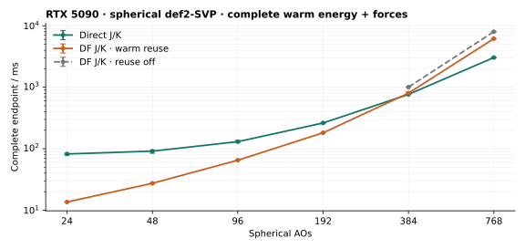
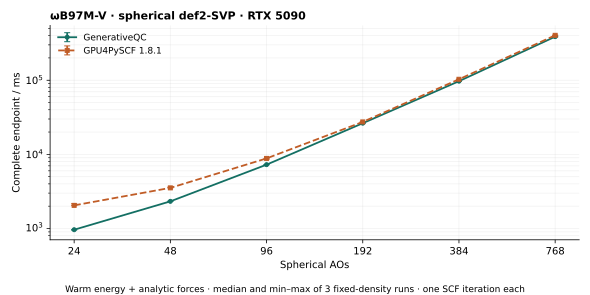

<!--
IMPORTANT: Keep this README concise and user-facing. It should contain only
the project identity, current supported methods, essential capabilities,
installation, and minimal examples. Put implementation history, kernel
details, benchmark analysis, and extended roadmaps in docs/ or
benchmarks/results/ instead of expanding this file.
-->

<p align="center">
  <picture>
    <source media="(prefers-color-scheme: dark)" srcset="assets/generativeqc-logo-dark.svg">
    
  </picture>
</p>

<h1 align="center">GenerativeQC</h1>

<p align="center">
  <a href="https://codecov.io/gh/jinzhezenggroup/generativeqc"></a>
</p>

<p align="center">
  <strong>Quantum chemistry generated across the stack.</strong><br>
  GPU-native, batched quantum chemistry with analytic forces.
</p>

## Why *Generative*QC?

GenerativeQC treats **generation as a design principle across the software stack**:

- **LLM-generated source** — coding agents and large language models help generate
  and evolve human-readable source code, tests, benchmarks, and documentation
  under human scientific review.
- **Generated scientific methods** — declarative descriptions such as `MethodIR`
  let method families, compositions, and metadata be generated instead of
  hand-wiring every variant.
- **Generated computational programs** — compiler IRs lower high-level
  electronic-structure definitions into executable program and computation-graph
  representations.
- **Generated kernels** — code generation and AOT specialization emit CPU and
  CUDA kernels specialized for methods, basis and shell structure, and target
  hardware.

In short: **scientific intent → LLM-generated source → generated methods →
generated programs → generated kernels**.

The LLM layer is a development workflow, not a surrogate for the underlying
quantum chemistry. Numerical results come from explicit electronic-structure
methods, are checked against independent references, and performance claims
require reproducible gates.

## Features

- **Compiler-generated quantum chemistry.** MethodIR, ProgramIR, and IntegralIR
  turn declarative scientific definitions into validated execution graphs,
  derivative/response programs, schedules, and specialized CPU/CUDA kernels.
  Built-in paths are AOT-first; JIT and autotuning are explicit opt-in workflows.
- **Hartree–Fock and correlated methods.** RHF/UHF provide energies and analytic
  nuclear forces with direct and density-fitted execution paths. Qualified public
  post-HF domains include MP2, RCCSD, and RCCSD(T), behind the same method registry
  and prepared-execution contracts.
- **Broad Kohn–Sham DFT.** RKS/UKS execution covers semilocal LDA/GGA/meta-GGA,
  global-hybrid, range-separated, and nonlocal-correlation compositions. MethodIR
  drives named and automatically imported Libxc selectors; qualified examples
  include PBE, PBE0, B3LYP, r2SCAN, WB97M-V, generic D4 compositions, and
  r2SCAN-3c.
- **Analytic derivatives with fail-closed capability gates.** Supported
  method/backend/property combinations expose native analytic forces, including
  CUDA HF, global-hybrid DFT, WB97M-V, composite r2SCAN-3c, and qualified
  correlated-method paths. Unsupported derivative domains fail explicitly rather
  than silently changing methods or backends.
- **GPU-native prepared execution.** Reusable CPU/CUDA plans retain topology and
  numerical state across calls, with density warm starts, ragged batches,
  per-system failure isolation, CUDA-resident execution, and resource/precision
  diagnostics.
- **GFN2-xTB.** Molecular energies and analytic forces are available on CPU and
  native CUDA SDK builds, including charged and standard restricted open-shell
  states for H-Rn with the method's intrinsic minimal basis.
- **Gaussian basis and ECP support.** Contracted Cartesian and real-spherical
  bases reach `s` through `g` on CPU and `s` through `f` on CUDA. Bundled
  basis data, [offline local/custom basis input](docs/user/external_basis.md) with
  H–Og identities, and [scalar Gaussian ECPs](docs/user/ecp.md) share explicit
  provenance and capability checks.
- **Multiple interfaces, one scientific core.** Python, C, C++, and a Python-free
  native CLI share the native runtime; PyTorch and JAX bindings reuse native
  analytic derivatives for custom backward paths.


## Build and install

Source builds require CMake 3.24+, a C++20 compiler, and Python 3.10+. CUDA
builds additionally require a supported CUDA toolchain.

Install the Python package from source:

```bash
python -m pip install .
```

For a CPU-only build:

```bash
GENERATIVEQC_ENABLE_CUDA=OFF python -m pip install .
```

For CUDA, select NVCC and the target architecture, for example:

```bash
CUDACXX=/path/to/cuda/bin/nvcc \
GENERATIVEQC_CUDA_ARCHITECTURES=120 \
python -m pip install .
```

Native development can use the provided CMake presets:

```bash
cmake --preset cuda-dev-fast
cmake --build --preset cuda-dev-fast
```

An installed native SDK/runtime does not require Python:

```bash
cmake --install build/cuda-dev-fast --prefix /opt/generativeqc
/opt/generativeqc/bin/generativeqc methods
```

See the [installation guide](docs/user/installation.md) for user setup and the
[build and CUDA configuration guide](docs/developer/build.md) for CMake profiles,
portable GPU targets, generated-AOT tuning, compiler caches, device linking,
split compilation, and SDK details.

## Methods

Stable native ABI IDs, providers and compatibility selectors are generated from
`manifests/public_methods.json`; see the
[public method catalog](docs/public_methods.md). DFT scientific names and
compositions are discovered from the compiler MethodIR catalog, including
generated metadata from the pinned Libxc sources. `Calculator(method=...)`
accepts qualified `<method>-rks` / `<method>-uks` selectors without requiring
one ABI-manifest row per functional.

Run the Python frontend (`python -m generativeqc methods`) for the current MethodIR-aware
public discovery set. MethodIR representation is
not by itself an execution promise: missing primitive lowerers, unsupported
backends/models, or method-specific requirements such as an explicit hybrid
grid fail closed. The Python API also accepts the composite selectors
`r2scan-3c`, `r2scan-3c-rks`, and `r2scan-3c-uks`.

```bash
python -m generativeqc methods
python -m generativeqc methods --json
```

## Python API

Coordinates are in Bohr, energies in Hartree, and forces in Hartree/Bohr.

```python
from generativeqc import Calculator

calc = Calculator(method="rhf", basis="sto-3g", device="cuda")
result = calc.singlepoint(
    [
        ("H", (0.0, 0.0, -0.7)),
        ("H", (0.0, 0.0, 0.7)),
    ]
)

print(result.energy)
print(result.forces)
```

Prepared batches retain reusable topology and density state:

```python
from generativeqc import Calculator

systems = [
    [("H", (0.0, 0.0, -0.7)), ("H", (0.0, 0.0, 0.7))],
    [("He", (0.0, 0.0, 0.0))],
]

calc = Calculator(method="rhf", basis="sto-3g", device="cuda")
with calc.prepare_batch(systems, warm_start=True) as batch:
    first = batch.execute(strict=True)
    second = batch.execute(strict=True)  # reuses compatible densities

print(first.energies)
```

## Benchmarks

| Method | Performance |
| --- | --- |
| HF (direct / DF) | <a href="benchmarks/results/df-one-step-warm-20260926/hf.svg"></a> |
| ωB97M-V / def2-SVP | <a href="benchmarks/results/wb97mv-active-ao-20261003/wb97mv.svg"></a> |

<!-- DFT benchmark rows are temporarily withheld from the rendered README.
Restore these rows to the table above only after approval to publish the results.
| PBE0 / def2-SVP | <a href="benchmarks/results/pbe0-grid-reuse-20261003/pbe0.svg"></a> |
| ωB97M-V / def2-TZVPD (OMol25) | <a href="benchmarks/results/omol25-wb97mv-20261001/default-hf-cartesian/omol25.svg"></a> |
-->

RTX 5090, spherical def2-SVP: complete warm RHF energy + forces, five repeats.
[Protocol and results](benchmarks/results/df-one-step-warm-20260926/README.md).

ωB97M-V uses an explicitly enabled integration candidate with SCF/force AO
selection and matched unpruned grids on an RTX 5090. The six-point figure uses
the same AO sizes and visual style as HF and shows warm medians and min–max
ranges over three fixed-density replays per engine. At 24–96 atoms, warm takes
3.9–5.8% less time. Complete cold startup is documented separately and remains
slower.
[Source, controls, cold timings and all-sample accuracy
gates](benchmarks/results/wb97mv-active-ao-20261003/README.md) identify the measured
path separately from the master default.

<!-- DFT benchmark discussion is temporarily withheld with the rows above.
PBE0 uses the same 3–96-atom water clusters, full spherical def2-SVP,
five fixed engine-local warm replays, and independent energy/force gates at
both original and changed geometries. Both engines use the same moving
quadrature; timings include analytic grid response and host-returned forces,
not energy-only SCF. Native uses the default direct FP64 path.
[PBE0 protocol and results](benchmarks/results/pbe0-grid-reuse-20261003/README.md).

OMol25-level DFT uses the same water clusters and five-repeat energy + force
protocol, with full spherical def2-TZVPD, a common moving grid and matched VV10
density masks. PR #1637's through-f composition is supplemented by public
capability and nuclear-dispatch fixes. Through-f execution now automatically
selects screened symmetry-canonical Cartesian-source J/K with HF projections
under the existing budget. The qualified 3-atom warm endpoint is 6.301 s versus
GPU4PySCF's 16.425 s; the incomplete 6-atom native run is not plotted as a timing.
Historical opt-in measurements retain their original build identities.
This is not an OMol25 dataset/ORCA
throughput measurement. Incomplete points are not timings.
[DFT protocol and results](benchmarks/results/omol25-wb97mv-20261001/README.md).
-->

## Documentation

Choose the path that matches what you are trying to do:

- [Learn quantum chemistry](docs/learn/index.md) — the minimum background needed to use GenerativeQC correctly.
- [User Guide](docs/user/index.md) — install GenerativeQC and run calculations.
- [Reference](docs/reference/index.md) — methods, capabilities, units, and lookup material.
- [Developer Guide](docs/developer/index.md) — architecture, implementation, and extension points.
- [Maintainer Guide](docs/maintainer/index.md) — validation, performance qualification, generated artifacts, and project operations.
- [Agent Guide](docs/agent/index.md) — workflow for coding agents; normative repository rules remain in [AGENTS.md](AGENTS.md).

## License

GenerativeQC is licensed under [GPL-3.0-or-later](LICENSE).
