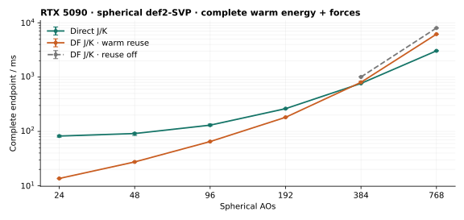

# CUDA DF: qualified one-step warm endpoints

Native direct and occupied DF RHF both take **one iteration** in every frozen
warm repeat at 24–768 AOs, including repeats after reconverging a moved geometry.
The shared energy/density/physical-residual gates and strict final Fock validation
are unchanged. At 768 AOs, DF takes **6.175 s**, direct **3.048 s**. Disabling warm
reuse in the same binary gives **8.021 s / 3 iterations**: reuse reduces DF's
complete endpoint by **23.0%**, while DF remains **2.03× direct**.



Lines show five-repeat medians and min/max bars for complete energy plus analytic
forces. All plotted iteration counts are stable. The gray control uses the same
library, separate owners and separately converged frozen seeds; it is not a
paired comparison of identical intermediate densities. Diagnostic traces are
separate from clean timings. No new GPU4PySCF timings were measured: the
[preceding comparison](../hf-unified-acceptance-20260926/README.md) retains its
own build and measurements.

## Warm medians

| Spherical AOs | Atoms | Direct, seconds | DF, seconds | DF reuse off, seconds | Direct / DF steps |
| ---: | ---: | ---: | ---: | ---: | --- |
| 24 | 3 | 0.082217 | 0.013620 | — | 1 / 1 |
| 48 | 6 | 0.091444 | 0.027437 | — | 1 / 1 |
| 96 | 12 | 0.130440 | 0.065085 | — | 1 / 1 |
| 192 | 24 | 0.262644 | 0.181975 | — | 1 / 1 |
| 384 | 48 | 0.766056 | 0.803204 | 1.005950 (3 steps) | 1 / 1 |
| 768 | 96 | 3.048253 | 6.174827 | 8.021126 (3 steps) | 1 / 1 |

DF is faster at 24–192 AOs, close to direct at 384 AOs (1.05×), and slower at
768 AOs. Equal iterations do not imply equal work or force-response cost. At
768 AOs, separate DF traces record **one SCF occupied-K build plus one final
occupied-K build**, versus three plus one with reuse disabled. Baseline retention
adds one energy reduction and **zero extra J/K builds**. It retains 19,857,408
bytes per host record and restores 983,040 occupied-factor bytes. Two records
and temporary snapshot readback are bounded by 64 MiB; no device buffer is added.
Force-response scratch remains 1,980,551,200 bytes, with 8,769,110,016 fitted-B
bytes borrowed from its existing owner. These complete-endpoint timings do not
provide a clean component-time split. Public native Fock counts remain `null`
where unavailable; the DF diagnostic companions retain actual work counters.

## Acceptance and scope

The production CUDA direct/DF acceptance rule remains:

```text
abs(E - previous_E) < energy_tolerance + 16*epsilon*max(1,abs(E),abs(previous_E))
density_step_rms < density_tolerance
max_abs(FDS-SDF) <= min(1e-8,density_tolerance)
```

Values must be finite. The physical residual precedes DIIS; strict final Fock
and determinant validation remains mandatory. This campaign uses `1e-12 Eh`
energy and `1e-10` density tolerances, maximum 100 iterations and `1e-12`
screening. The shared guard is unchanged from the preceding qualification.

Warm reuse requires an exact match of density, Hcore, overlap, orthogonalizer,
occupation, nuclear energy and immutable plan/source identity. Only a completed
strict endpoint publishes the immutable density/orbital/compatible-energy record.
The next call still builds physical J/K, diagonalizes, forms the next density
and applies all gates. It is not a skipped calculation or a forced iteration
count. The qualified scope is DIIS-enabled singleton occupied RHF; UHF, batches,
no-DIIS, corrected final frames, mismatched geometry/data and unavailable cache
capacity keep bounded fallbacks. Cold or changed geometry is not guaranteed one
step. See the [current contract](../../../docs/developer/df_occupied_cuda.md)
and [decision](../../../.agents/notes/implemented/performance/2026-09-26-df-qualified-one-step-warm.md).

All **184 native endpoints** pass independent **1e-8 Eh / 1e-7 Eh/Bohr** gates.
Maximum errors are **2.6421e-10 Eh / 1.4052e-10 Eh/Bohr**. The total comprises
156 direct/enabled-DF endpoints and 28 disabled-DF controls: **168 clean plus
16 diagnostic**. Cold, all five original warm, moved, all five moved-warm and
every diagnostic endpoint are checked. Each approximation has its own
geometry/protocol-matched independent GPU4PySCF reference from Slurm job 11803;
direct and DF are never gated against each other. The reducer verifies the
original raw reference hash and retained arrays before rechecking every new
endpoint. Reusing independent reference arrays makes no new reference timing claim.

## Cold and changed geometry

Cold and moved are single observations; moved-warm is the median of five frozen
repeats. Each cell is **seconds / iteration count**. The moved endpoint displaces
the second atom by +0.001 Bohr along z and reconverges normally before freezing
its new density. All individual values remain in the JSON companions.

| AOs | Route | Cold | Moved | Moved-warm |
| ---: | --- | --- | --- | --- |
| 24 | direct | 1.033433 / 19 | 0.529718 / 14 | 0.074664 / 1 |
| 24 | DF | 0.270580 / 17 | 0.048412 / 12 | 0.013802 / 1 |
| 48 | direct | 1.157212 / 22 | 0.605436 / 15 | 0.084420 / 1 |
| 48 | DF | 0.366413 / 19 | 0.098928 / 12 | 0.027503 / 1 |
| 96 | direct | 1.803055 / 27 | 0.936556 / 16 | 0.120879 / 1 |
| 96 | DF | 0.571670 / 23 | 0.252187 / 12 | 0.065278 / 1 |
| 192 | direct | 3.348886 / 20 | 2.450451 / 15 | 0.263666 / 1 |
| 192 | DF | 1.174649 / 18 | 0.792325 / 13 | 0.181050 / 1 |
| 384 | direct | 11.661949 / 24 | 7.386265 / 16 | 0.768069 / 1 |
| 384 | DF | 5.564594 / 21 | 4.354594 / 13 | 0.812855 / 1 |
| 384 | DF reuse off | 5.558820 / 21 | 4.331104 / 13 | 1.011090 / 3 |
| 768 | direct | 41.559255 / 26 | 27.169432 / 16 | 3.050436 / 1 |
| 768 | DF | 47.029150 / 24 | 36.553700 / 13 | 6.203996 / 1 |
| 768 | DF reuse off | 47.022523 / 24 | 36.571190 / 13 | 8.040942 / 3 |

## Protocol and provenance

- Nested prefixes of the README water32mer, neutral spherical def2-SVP RHF;
  DF uses cc-pVDZ-JKFIT. Exact coordinates, auxiliary-basis hash and independent
  original/moved arrays are linked by checksum from each companion.
- Sequential separate native processes under Slurm **11809**, partition `main`,
  `--gres=gpu:5090:1`, finite 15-minute limit. RTX 5090, 32,607 MiB,
  driver 580.95.05, CUDA 12.9.1; eight OpenMP/OpenBLAS/MKL threads.
  NumPy 2.4.6 and PySCF 2.14.0. Reference arrays were produced with GPU4PySCF
  1.8.1 in the preceding campaign. Resident engine tensors never coexist.
- Cold includes preparation plus the first synchronized complete execution;
  imports/library probes are excluded. Geometry refresh is timed. Warm inputs
  are frozen after cold or moved convergence, with density updates disabled.
- DF explicitly selects `packed-single`, occupied exchange/response, fitted
  occupied source, derivative schedule `qualify`, response algebra `blas`,
  final exchange `auto` and occupied metric `auto`. Response allowances are
  64 MiB through 96 AOs, 256 MiB at 192 AOs, 1,000,000,000 bytes at 384 AOs and
  5,000,000,000 bytes at 768 AOs. Default storage/response planners are unchanged.
- Shared Release sm_120 HF-AOT library SHA-256:
  `7ed5127ad22e919dbdc3e055ec8b2efd0c0725c4ebd620e80d546b8065483c3e`.
  Stationary DFT-force AOT disabled; RHF shell AOT enabled. Measured source is
  `f535ebd5e3b4bb4180c3ede043ae37fcdfbed8f4` plus
  [measured-source.patch](measured-source.patch). Later edits affect documentation,
  evidence rendering and host tests, not native or benchmark execution logic.

[summary.json](summary.json) binds all 14 workload records by hash and size and
stores the shared build/source/acceptance identity. Each record contains exact
scalar sample rows with explicit `columns`, grouped diagnostic work counters,
raw result hashes and a checksum-bound link to its independent reference record.
Read samples with `dict(zip(record["columns"], row, strict=True))`.
[validation.json](validation.json) pins source/library and validation receipts.
Full logs, traces and binaries remain in ignored local artifacts.

Four native suites pass: final snapshot/cache, physical force convergence,
occupied response and mixed precision. The new closed-form nonidentity-overlap
fixture tests one-step iteration limits, missing baselines, mismatched inputs,
stale tokens and failed-solve invalidation. There are 44 passing existing GPU
cases plus four new molecular cases (frozen/advancing × two auxiliary bases),
with independent PySCF gates of 1e-9 Eh / 1e-8 Eh/Bohr. The native snapshot suite
passes Compute Sanitizer memcheck with zero errors (job 11810). The existing
host endpoint/structure/ownership group passes 134 tests. Validation receipts
preserve the initial fixture/test mistakes and missing sanitizer PATH retry;
none required relaxing a production gate. The previously disclosed six
[packed-cache replay assertions](../df-final-occupied-endpoint-20260926/README.md#numerical-and-robustness-validation)
remain a separate baseline regression.

## Reproduce

Use the Release build and Python dependency setup in the
[preceding protocol](../hf-unified-acceptance-20260926/README.md#reproduce).
From the repository root, regenerate independent references and enabled endpoints
into a fresh directory, then add the same-binary disabled controls:

```bash
export HF_BENCHMARK_OUTPUT="$PWD/.artifacts/df-one-step-reproduction"
export HF_BENCHMARK_PYTHON="$(command -v python)"
export PYTHONPATH=python:.
export OMP_NUM_THREADS=8 OPENBLAS_NUM_THREADS=8 MKL_NUM_THREADS=8
srun --partition=main --gres=gpu:5090:1 --nodes=1 --ntasks=1 \
  --time=00:35:00 bash benchmarks/run_hf_acceptance_benchmarks.sh
srun --partition=main --gres=gpu:5090:1 --nodes=1 --ntasks=1 \
  --time=00:10:00 bash -c '
set -euo pipefail
for aos in 384 768; do
  "$HF_BENCHMARK_PYTHON" -m benchmarks.compare_df_direct_endpoint native \
    --nested-water --aos "$aos" --route df --repeats 5 --disable-warm-reuse \
    --reference "$HF_BENCHMARK_OUTPUT/$aos/reference-df/results.json" \
    --output "$HF_BENCHMARK_OUTPUT/$aos/df-disabled"
done'
python -m tools.render_hf_acceptance_benchmarks \
  --raw-directory "$HF_BENCHMARK_OUTPUT" \
  --destination .artifacts/df-one-step-reference-records
python -m tools.render_df_warm_reuse_benchmarks \
  --raw-directory "$HF_BENCHMARK_OUTPUT" \
  --reference-directory "$HF_BENCHMARK_OUTPUT" \
  --reference-records .artifacts/df-one-step-reference-records \
  --destination .artifacts/df-one-step-figure
```

The renderer requires all six sizes and five repeats. For this retained campaign,
the raw native directory was `.artifacts/df-warm-one-step-20260926/endpoints`,
the raw reference directory `.artifacts/df-unified-acceptance-20260926/endpoints`,
and `--reference-records` was `benchmarks/results/hf-unified-acceptance-20260926`.
Slurm device visibility is preserved throughout.
