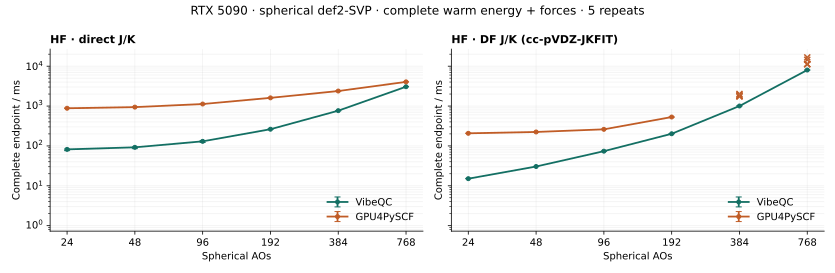

# CUDA HF: common direct/DF acceptance

Complete energy plus analytic-force endpoints on an RTX 5090. Native direct and
DF share the FP64 iterative acceptance rule below and retain strict final Fock
validation. This explicit DF route is faster than direct at 24–192 AOs, but
slower at 384 and 768 AOs. At 768 AOs, DF takes **8.010 s / 3 iterations** versus
direct's **3.056 s / 1 iteration**: **2.62×** the complete endpoint time.



The figure uses a common time scale. Lines show five-repeat medians with min/max
bars only when an engine's iteration count is stable at that size. **×** shows
every sample where the count varies; these samples are not joined into a stable
line. The table below reports the median of all five successful repeats,
including variable branches. These are complete endpoint comparisons, not
equal-work J/K kernel measurements.

## Warm medians, seconds

| Spherical AOs | Atoms | VibeQC direct | GPU4PySCF direct | VibeQC DF | GPU4PySCF DF |
| ---: | ---: | ---: | ---: | ---: | ---: |
| 24 | 3 | 0.081926 | 0.880455 | 0.015085 | 0.207237 |
| 48 | 6 | 0.092252 | 0.940502 | 0.030461 | 0.223901 |
| 96 | 12 | 0.130381 | 1.124118 | 0.073849 | 0.260715 |
| 192 | 24 | 0.262290 | 1.605668 | 0.201850 | 0.530312 |
| 384 | 48 | 0.765330 | 2.381099 | 1.003100 | 1.771504 |
| 768 | 96 | 3.055674 | 4.042483 | 8.009645 | 11.254863 |

Observed warm SCF iteration sets and actual reference SCF `get_veff` calls:

| AOs | Native direct iterations | Native DF iterations | Reference direct iterations / builds | Reference DF iterations / builds |
| ---: | ---: | ---: | --- | --- |
| 24 | 1 | 2 | 1 / 2 | 1 / 2 |
| 48 | 1 | 2 | 1 / 2 | 1 / 2 |
| 96 | 1 | 2 | 1 / 2 | 1 / 2 |
| 192 | 1 | 2 | 1 / 2 | 1 / 2 |
| 384 | 1 | 3 | 1 / 2 | {1, 2, 3} / {2, 3, 4} |
| 768 | 1 | 3 | 1 / 2 | {2, 5, 7} / {3, 6, 8} |

Reference build counts include the pre-loop Fock and exclude gradient
contractions. Native public Fock counts remain `null` because the API does not
export them. The DF companions retain separate diagnostic operation/counter
records: at 768 AOs, the warm replay performs three SCF occupied-K builds and
one final occupied-K build. Final occupied K and the retained metric root remain
active; the force-response scratch is 1,980,551,200 bytes, and the fitted B
borrowed from its existing owner is 8,769,110,016 bytes. A null count is never
interpreted as zero work.

## Shared native acceptance and independent accuracy

The common CUDA FP64 RHF/UHF comparator requires finite values and all of:

```text
abs(E - previous_E) < energy_tolerance + 16*epsilon*max(1,abs(E),abs(previous_E))
density_step_rms < density_tolerance
max_abs(FDS-SDF) <= min(1e-8,density_tolerance)
```

The residual is the physical pre-DIIS Fock residual, covering both UHF spins.
This campaign uses `energy_tolerance=1e-12 Eh` and `density_tolerance=1e-10`.
The FP64 energy guard is about `8.64e-12 Eh` at 768 AOs. Reported energy changes
remain raw differences, and strict physical final-state validation still runs.
No new residual matrix or GEMM is needed: the production DIIS paths reuse the
current residual. Low-level no-DIIS compatibility paths have no iterative
residual buffer and keep mandatory final validation; host numerical recovery
retains its stricter unguarded comparison.

Direct can reuse a density/geometry-qualified energy baseline. DF rebuilds its
seed and begins without one. Sharing the comparator therefore does not imply
identical iteration counts. At 768 AOs, DF still rejects the approximately
`2e-10 Eh` seed-to-canonical shift; it now accepts iteration 3 with a raw change
of `4.5475e-12 Eh`. A qualified DF warm density/orbital/energy cache remains
unimplemented. The earlier [five-iteration measurement](../df-final-occupied-endpoint-20260926/README.md)
used a different binary and is not pooled with this campaign.

GPU4PySCF uses its own solver stopping logic, `1e-12 Eh` energy tolerance,
`1e-10` orbital-gradient tolerance, full Fock builds and `1e-14` direct
screening. We do not claim its internal acceptance is identical to VibeQC's.
Each method has its **own approximation-matched independent reference**;
direct and DF energies are not gated against each other.

All **156 native endpoints** pass unchanged independent gates of `1e-8 Eh`
and `1e-7 Eh/Bohr`, including cold, changed geometry and diagnostic endpoints.
The maxima are **2.6421e-10 Eh** and **1.4052e-10 Eh/Bohr**. There are 144 clean
native endpoints, 12 separate DF trace endpoints and 144 reference endpoints.
Every clean warm phase retains five repeats; no slow or inaccurate branch is
discarded. The reducer independently rechecks the raw arrays before retaining
the scalar errors and rejects incomplete or mismatched runs.

## Cold and changed geometry

Cold and moved are single observations. Each cell is **VibeQC / GPU4PySCF** in
seconds; moved-warm is the five-repeat median. All individual timings and
iteration/build counts are in the per-workload JSON companions.

| AOs | Route | Cold | Moved | Moved-warm |
| ---: | --- | --- | --- | --- |
| 24 | direct | 1.049795 / 12.397511 | 0.530405 / 10.988660 | 0.074037 / 0.881713 |
| 24 | DF | 0.274474 / 1.035339 | 0.048038 / 0.456909 | 0.015132 / 0.207132 |
| 48 | direct | 1.167403 / 16.281825 | 0.604314 / 11.684518 | 0.082909 / 0.937873 |
| 48 | DF | 0.381590 / 1.175228 | 0.098705 / 0.506407 | 0.030505 / 0.225704 |
| 96 | direct | 1.783787 / 18.938101 | 0.932551 / 14.071517 | 0.121204 / 1.120797 |
| 96 | DF | 0.576859 / 1.352996 | 0.251524 / 0.661888 | 0.073857 / 0.260500 |
| 192 | direct | 3.355963 / 23.721115 | 2.451539 / 20.725770 | 0.262892 / 1.608630 |
| 192 | DF | 1.172807 / 2.078401 | 0.783832 / 1.374841 | 0.199352 / 0.531207 |
| 384 | direct | 11.671066 / 33.840220 | 7.366921 / 28.548863 | 0.766612 / 2.395884 |
| 384 | DF | 5.581971 / 7.958879 | 4.343178 / 6.363677 | 1.008607 / 1.893154 |
| 768 | direct | 40.202016 / 54.322324 | 27.260336 / 45.542400 | 3.056949 / 5.159640 |
| 768 | DF | 47.032090 / 58.288013 | 36.539938 / 48.991697 | 8.042500 / 10.187481 |

Reference moved-warm iterations also vary: direct 384 {1, 2}, direct 768
{1, 2, 3, 4}, DF 384 {1, 2} and DF 768 {1, 2, 7}. These observations are
retained and included in the table medians.

## Protocol, route and provenance

- Nested prefixes of the README water32mer, spherical def2-SVP, neutral RHF,
  3–96 atoms / 24–768 AOs. DF uses practical cc-pVDZ-JKFIT auxiliaries; exact
  geometry arrays and auxiliary-basis hash are retained. The second atom moves
  +0.001 Bohr along z. Native screening is `1e-12`, maximum iterations 100.
- Separate sequential engine processes under Slurm job **11803**, partition
  `main`, `--gres=gpu:5090:1`, 35-minute limit. NVIDIA RTX 5090, 32,607 MiB,
  driver 580.95.05, CUDA 12.9.1, eight OpenMP/OpenBLAS/MKL threads. NumPy 2.4.6,
  PySCF 2.14.0, GPU4PySCF 1.8.1. Engine resident DF tensors never coexist.
- Cold includes preparation plus the first synchronized complete execution;
  imports and library/probe loading are excluded. Native geometry refresh and
  reference moved-molecule preparation are timed. Five original warm calls
  start from each engine's frozen post-cold density; five moved-warm calls use
  its frozen post-move density. Density updates are disabled for native replays.
  Diagnostic replays are excluded from clean timing medians.
- DF explicitly selects `packed-single`, occupied exchange/response,
  `VIBEQC_DF_OCCUPIED_RESPONSE_SOURCE=fitted`, derivative schedule `qualify`,
  response algebra `blas`, final exchange `auto` and occupied metric `auto`.
  Response allowances are 64 MiB through 96 AOs, 256 MiB at 192 AOs,
  1,000,000,000 bytes at 384 AOs and 5,000,000,000 bytes at 768 AOs. This
  qualifies that route; default storage/response planners are unchanged.
- Shared Release sm_120 HF-AOT library, SHA-256
  `1a016b3da7ed149d5afe26935eef3f3c5fb49eb80dc787079695c52f2e6bfba3`.
  Optional DFT stationary-force AOT is disabled; RHF shell AOT is enabled.
  Measured source is `ac4cdc46da55feb6c1ac8baca3a60a7b415702a4` plus
  [measured-source.patch](measured-source.patch). Later edits add documentation,
  the renderer and host checks, plus a benchmark module docstring; measured
  native and benchmark execution logic are unchanged.

[summary.json](summary.json) binds twelve workload records and six diagnostic
companions by hash and size. They retain all scalar samples, independent reference arrays, raw-artifact
hashes, source/build/protocol identities and separate DF work counters.
`tools.vibeqc_validation.record.load_record` reconstructs each complete workload
after checking its diagnostic companion's hash and size.
[validation.json](validation.json) pins the source patch, native library and
validation receipts. Full traces, logs and binaries stay in ignored local
artifacts; no external archive is needed for reproduction.

Validation includes four native suites (force convergence, mixed precision,
DF final snapshot and occupied response), 44 GPU molecular tests, 15 endpoint
protocol/reducer tests, and 136 ownership/structure/README tests. The broader
host benchmark/protocol group passes 76 tests after correcting a missing
`VIBEQC_LIBRARY` environment setting in one test; the 15-test group overlaps
that group and is not added to its total. Compute Sanitizer reports zero errors
for the convergence suite. The previously disclosed six packed-cache replay
assertions remain a separate [baseline regression](../df-final-occupied-endpoint-20260926/README.md#numerical-and-robustness-validation);
this change does not claim to fix them.

## Reproduce

Use a fresh output directory and a Python environment with compiler dependencies,
PySCF, GPU4PySCF and CuPy. The plotting Python additionally needs Matplotlib.
From the repository root:

```bash
cmake --preset cuda-release-sm120 \
  -DCMAKE_CUDA_COMPILER=/group/software/cuda-12.9.1/bin/nvcc \
  -DPython3_EXECUTABLE="$(command -v python)" \
  -DVIBEQC_BUILD_TESTS=ON -DVIBEQC_ENABLE_AOT_SHELLS=ON \
  -DVIBEQC_ENABLE_STATIONARY_FORCE_AOT=OFF
cmake --build --preset cuda-release-sm120 --target vibeqc -j8
export VIBEQC_LIBRARY="$PWD/build/cuda-release-sm120/libvibeqc.so"
export CUDA_PATH=/group/software/cuda-12.9.1
export LD_LIBRARY_PATH="$CUDA_PATH/lib64${LD_LIBRARY_PATH:+:$LD_LIBRARY_PATH}"
export HF_BENCHMARK_PYTHON="$(command -v python)"
export HF_BENCHMARK_OUTPUT="$PWD/.artifacts/hf-unified-reproduction"
srun --partition=main --gres=gpu:5090:1 --nodes=1 --ntasks=1 \
  --time=00:35:00 bash benchmarks/run_hf_acceptance_benchmarks.sh
PYTHONPATH=python:. python -m tools.render_hf_acceptance_benchmarks \
  --raw-directory "$HF_BENCHMARK_OUTPUT" \
  --destination .artifacts/hf-unified-reproduction-figure
```

The runner preserves Slurm device visibility and refuses existing individual
result directories. `HF_BENCHMARK_AOS` and `HF_BENCHMARK_REPEATS` can select a
smaller diagnostic run; the README renderer requires all six sizes and five
repeats by default.
